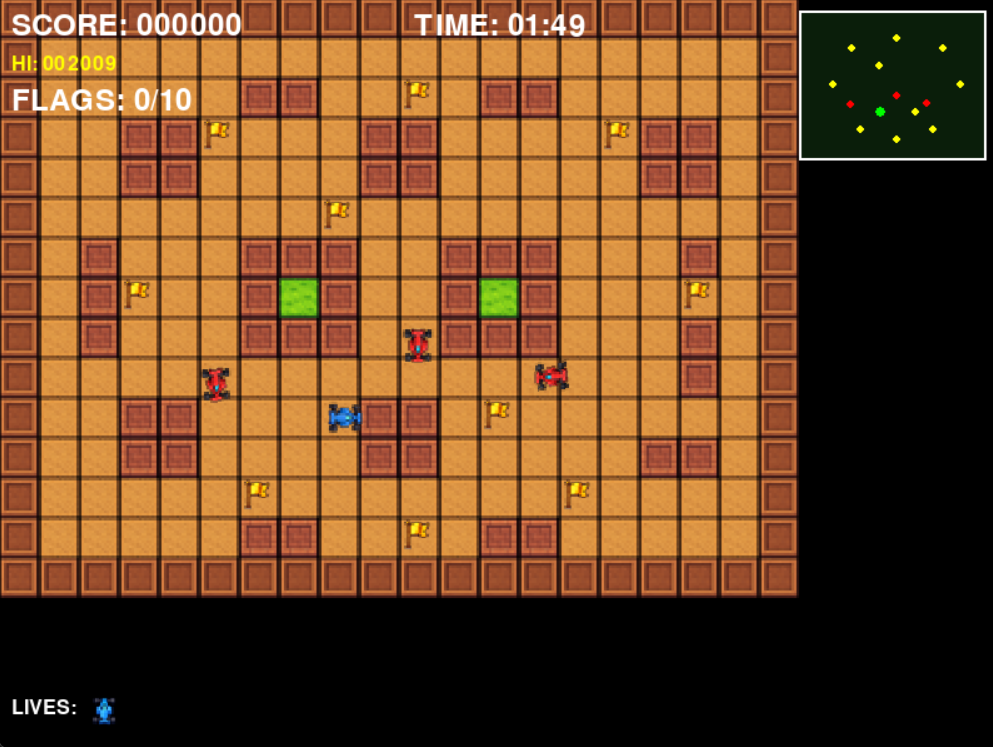

# 🏎️ Rally-X Clone

Um clone do clássico jogo arcade Rally-X desenvolvido com Python e Pygame.



## 📋 Sobre o Jogo

Rally-X Clone é um jogo de ação/arcade onde você controla um carro que deve:
- Navegar por um labirinto
- Coletar todas as 10 bandeiras
- Evitar os carros inimigos
- Usar fumaça estrategicamente para escapar
- Completar antes do tempo acabar!

## 🎮 Controles

| Ação | Tecla |
|------|-------|
| Mover | Setas ou WASD |
| Soltar Fumaça | Espaço |
| Pausar | Esc |
| Confirmar | Enter |

## ⚙️ Instalação

### Requisitos
- Python 3.8+
- Pygame 2.5+

### Passos

```bash
# 1. Clone ou baixe o projeto
cd rallyx_clone

# 2. Crie um ambiente virtual (opcional, recomendado)
python -m venv .venv

# Windows
.venv\Scripts\activate

# Linux/macOS
source .venv/bin/activate

# 3. Instale as dependências
pip install -r requirements.txt

# 4. Execute o jogo
python -m rallyx_clone
```

## 🕹️ Como Jogar

1. **Objetivo**: Colete todas as 10 bandeiras antes do tempo acabar
2. **Inimigos**: Carros vermelhos perseguem você - evite-os!
3. **Fumaça**: Pressione Espaço para soltar uma nuvem de fumaça que confunde os inimigos
4. **Vidas**: Você tem 3 vidas - colisão com inimigos = perde 1 vida
5. **Radar**: Use o mini-mapa no canto superior direito para localizar bandeiras e inimigos

## 📁 Estrutura do Projeto

```
rallyx_clone/
├── src/rallyx_clone/
│   ├── core/           # Sistemas centrais (assets, audio, estado)
│   ├── gameplay/       # Entidades do jogo (player, enemy, flags)
│   ├── scenes/         # Cenas (title, game, pause, gameover)
│   ├── ui/             # Interface (HUD, menus, widgets)
│   └── utils/          # Utilitários
├── requirements.txt
├── pyproject.toml
└── README.md
```

## 🏆 Pontuação

| Ação | Pontos |
|------|--------|
| Coletar bandeira | +100 |
| Completar fase | +500 |
| Tempo restante | +5 por segundo |

O high score é salvo automaticamente em `saves/highscore.json`.

## 🎛️ Opções

- **Dificuldade**: Fácil / Normal / Difícil
- **Volume Música**: 0-100%
- **Volume Efeitos**: 0-100%
- **Tela Cheia**: Sim / Não
- **VSync**: Sim / Não

## 📄 Licença

MIT License - Veja [LICENSE](LICENSE) para detalhes.

---

Desenvolvido com ❤️ usando Python e Pygame
"# rallyx_clone" 
